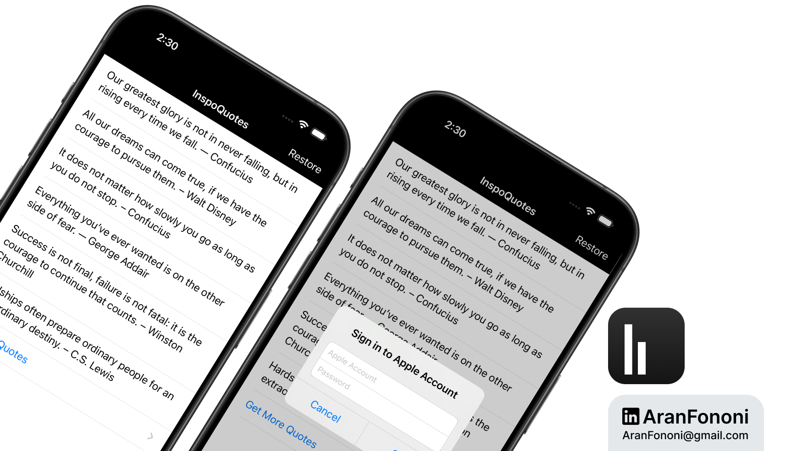

# InspoQuotes - Quote App with In-App Purchases

### Project for Section 20: **Quote Application with App StoreKit**  
This project was completed as part of Section 20 in the **Complete iOS Development Bootcamp** by Angela Yu.

## Project Overview
**InspoQuotes** is a motivational quotes app that offers both free and premium content. By integrating **StoreKit** for in-app purchases, the app allows users to purchase access to a wider range of premium quotes.

## What I Learned
In this project, I focused on:
- **StoreKit Integration**: Used StoreKit to manage in-app purchases for unlocking premium content.
- **Transaction Management**: Implemented SKPaymentTransactionObserver to handle purchasing, restoring transactions, and managing failed transactions.
- **UserDefaults**: Leveraged UserDefaults to save and retrieve purchase status, allowing for seamless access to previously purchased content.

## Key Skills
- Proficiency in using StoreKit for in-app purchases and product management
- Experience handling transactions and updating UI based on purchase status
- Familiarity with using UserDefaults for saving simple data locally

## Additional Features
- Allows users to restore previous purchases, maintaining access across devices.
- Provides feedback when transactions succeed or fail.

---

### Project Preview

---

### Footer

---

## Contact
For more information, feel free to reach out:  
- **Email**: [aranfononi@gmail.com](mailto:aranfononi@gmail.com)  
- **LinkedIn**: [Aran Fononi](https://www.linkedin.com/in/aran-fononi-18182b265)
